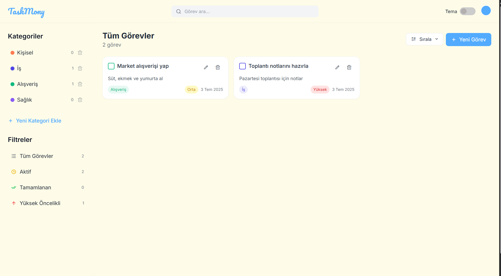

# TaskMony - Görev Yönetim Uygulaması

TaskMony, kullanıcıların görevlerini organize etmelerine olanak tanıyan modern ve kullanıcı dostu bir web uygulamasıdır. Görev ekleme, düzenleme, kategorilere ayırma, filtreleme ve sıralama gibi özelliklerle günlük işlerinizi kolayca yönetebilirsiniz.


## Özellikler
- **Görev Yönetimi**: Görev ekleme, düzenleme ve silme.
- **Kategori Yönetimi**: Özel kategoriler oluşturma, renk seçimi ve kategori silme.
- **Tema Desteği**: Açık ve koyu tema arasında geçiş yapma, özel renk teması seçimi.
- **Mobil Uyumluluk**: Responsive tasarım ile telefon ve tabletlerde sorunsuz kullanım.
- **Filtreleme ve Sıralama**: Görevleri durum, öncelik veya tarihe göre filtreleme ve sıralama.
- **Erişilebilirlik**: Ekran okuyucular için `aria-label` ve klavye navigasyonu desteği.
- **Yerelleştirme**: Türkçe dil desteği ve yerel tarih formatlama.
- **Veri Depolama**: Görevler ve kategoriler tarayıcıda `localStorage` ile kaydedilir.

## Ekran Görüntüleri
| Ana Ekran (Açık Tema) | Koyu Tema |
|------------------------|------------|
|  |  |

## Kurulum

TaskMony'yi yerel bilgisayarınızda çalıştırmak için aşağıdaki adımları izleyin:

1. Depoyu klonlayın:
   ```bash
   git clone https://github.com/developerharmony/taskmony.git
   ```
2. Proje dizinine gidin:
   ```bash
   cd taskmony
   ```
3. Bir web sunucusu ile projeyi çalıştırın. Örneğin:
   - **VS Code Live Server**: VS Code'da `Go Live` seçeneğini kullanın.
   - **Node.js**: `npx serve` komutunu çalıştırın.
   - Alternatif olarak, `index.html` dosyasını doğrudan modern bir tarayıcıda açabilirsiniz (ancak bazı özellikler için sunucu gerekebilir).

## Kullanım

- **Görev Ekleme/Düzenleme**: Sağ üstteki "Yeni Görev" butonuna tıklayın veya mevcut bir görevi düzenlemek için kalem simgesine tıklayın.
- **Kategori Ekleme**: Sidebar'daki "Yeni Kategori Ekle" butonuna tıklayın ve bir isim ile renk seçin.
- **Tema Değiştirme**: Sağ üstteki tema anahtarını kullanarak açık/koyu tema arasında geçiş yapın. Renk seçici ile özel bir tema rengi belirleyin.
- **Görev Filtreleme**: Sidebar'daki filtreler (Tüm Görevler, Aktif, Tamamlanan, Yüksek Öncelikli) ile görevleri görüntüleyin.
- **Görev Arama**: Üstteki arama çubuğunu kullanarak görevleri başlığa veya açıklamaya göre filtreleyin.
- **Sıralama**: "Sırala" butonundan tarih veya öncelik sırasına göre görevleri düzenleyin.

## Desteklenen Tarayıcılar
- Google Chrome (son sürüm)
- Mozilla Firefox (son sürüm)
- Safari (son sürüm)
- Microsoft Edge (son sürüm)


## Geliştirme Ortamı
- **Teknolojiler**: HTML, CSS (Tailwind CSS), JavaScript
- **Bağımlılıklar**: 
  - Tailwind CSS (CDN üzerinden)
  - Remixicon (ikonlar, CDN üzerinden)
  - Google Fonts (Pacifico ve Inter)
- **Geliştirme Araçları**: VS Code, Live Server

## Lisans

Bu proje [MIT Lisansı](LICENSE) ile lisanslanmıştır. Daha fazla bilgi için `LICENSE` dosyasını inceleyin.

## İletişim

Sorularınız veya önerileriniz için:
- GitHub: [developerharmony](https://github.com/developerharmony)
- E-posta: <a href="mailto:dev.harmony1@gmail.com">Bana Mail Gönderin</a>

---

# TaskMony - Task Management Application

TaskMony is a modern and user-friendly web application that allows users to organize their tasks. It supports task creation, editing, categorization, filtering, and sorting to help you manage your daily work efficiently.

🇹🇷 [Türkçe README](#taskmony---görev-yönetim-uygulaması)

## Features
- **Task Management**: Add, edit, and delete tasks.
- **Category Management**: Create custom categories with color selection and delete categories.
- **Theme Support**: Toggle between light and dark themes, with custom color theme selection.
- **Mobile Compatibility**: Responsive design for seamless use on phones and tablets.
- **Filtering and Sorting**: Filter tasks by status, priority, or date, and sort them accordingly.
- **Accessibility**: Support for screen readers with `aria-label` and keyboard navigation.
- **Localization**: Turkish language support and localized date formatting.
- **Data Storage**: Tasks and categories are saved in the browser using `localStorage`.

## Screenshots
| Main Screen (Light Theme) | Dark Theme |
|---------------------------|------------|
|  |  |

## Installation

To run TaskMony locally on your computer, follow these steps:

1. Clone the repository:
   ```bash
   git clone https://github.com/developerharmony/taskmony.git
   ```
2. Navigate to the project directory:
   ```bash
   cd taskmony
   ```
3. Run the project with a web server. For example:
   - **VS Code Live Server**: Use the `Go Live` option in VS Code.
   - **Node.js**: Run `npx serve` in the terminal.
   - Alternatively, open `index.html` directly in a modern browser (note that some features may require a server).

## Usage

- **Add/Edit Tasks**: Click the "New Task" button in the top-right corner or click the pencil icon to edit an existing task.
- **Add Categories**: Click "Add New Category" in the sidebar and choose a name and color.
- **Change Theme**: Use the theme toggle in the top-right corner to switch between light and dark modes. Use the color picker to set a custom theme color.
- **Filter Tasks**: Use the sidebar filters (All Tasks, Active, Completed, High Priority) to view tasks.
- **Search Tasks**: Use the search bar at the top to filter tasks by title or description.
- **Sort Tasks**: Click the "Sort" button to arrange tasks by date or priority.

## Supported Browsers
- Google Chrome (latest version)
- Mozilla Firefox (latest version)
- Safari (latest version)
- Microsoft Edge (latest version)


## Development Environment
- **Technologies**: HTML, CSS (Tailwind CSS), JavaScript
- **Dependencies**:
  - Tailwind CSS (via CDN)
  - Remixicon (icons, via CDN)
  - Google Fonts (Pacifico and Inter)
- **Development Tools**: VS Code, Live Server

## License

This project is licensed under the [MIT License](LICENSE). See the `LICENSE` file for more details.

## Contact

For questions or suggestions:
- GitHub: [developerharmony](https://github.com/developerharmony)
- Email: <a href="mailto:dev.harmony1@gmail.com">Send me mail.</a>
